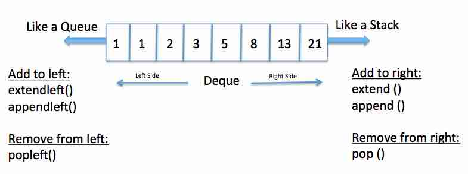

# Tips

* list : .append .pop
* 완전탐색, 트리맵
* 최대횟수, 더이상 동작하지 않을 때 까지 while

```python
import sys
sys.stdin.readline().rsplit('\n')
```

```python
# comparator 함수로 정렬 조건을 정함
from functools import cmp_to_key
sorted(lst, key=cmp_to_key(comparator))
# 정렬 조건이 두 개일때 이렇게도 가능하다
lambda x : (x[0], -x[1])
```

```python
def rotate_a_matrix_by_90_degree(a):
    n = len(a)  # 행 길이 계산
    m = len(a[0])  # 열 길이 계산

    result = [[0] * n for _ in range(m)]  ## 결과 리스트
    for i in range(n):
        for j in range(m):
            result[j][n - i - 1] = a[i][j]

    return result
```

```python
from bisect import bisect_left, bisect_right


# 값이 [left_value, right_value]인 데이터 개수를 반환하는 함수
def count_by_range(a, left_value, right_value):
    right_index = bisect_right(a, right_value)
    left_index = bisect_left(a, left_value)
    return right_index - left_index


# 배열 선언
a = [1, 2, 3, 3, 3, 3, 4, 4, 8, 9]

# 값이 4인 데이터 개수 출력
print(count_by_range(a, 4, 4))

# 값이 [-1, 3] 범위에 있는 데이터 개수 출력
print(count_by_range(a, -1, 3))


# 정확히 값이 x인 데이터의 인덱스 반환
def index_of_x(a, x):
    i = bisect_left(a, x)
    if i != len(a) and a[i] == x:
        return i
    return None


# x보다 작은 데이터 중에서, 가장 큰 값의 인덱스를 반환
def index_of_less_than_x(a, x):
    i = bisect_left(a, x)
    # x 보다 작은 데이터가 존재하는 경우
    if i:
        return i - 1  # 그 중에서 가장 큰 값의 인덱스 반환
    # x가 모든 데이터의 값 이하인 경우 None 반환
    return None


# x보다 작거나 같은 데이터 중에서, 가장 큰 값의 인덱스를 반환
def index_of_less_or_equal_than_x(a, x):
    i = bisect_right(a, x)
    # x보다 작거나 같은 데이터가 존재하는 경우
    if i:
        return i - 1  # 그 중에서 가장 큰 값의 인덱스 반환
    # x가 모든 데이터의 값보다 작은 경우 None 반환
    return None


# x보다 큰 데이터 중에서, 가장 작은 값의 인덱스를 반환
def index_of_greater_than_x(a, x):
    i = bisect_right(a, x):
    # x 보다 큰 데이터가 존재하는 경우
    if i != len(a):
        return i  # 그 중에서 가장 작은 값의 인덱스 반환
    # x가 모든 데이터의 값 이상인 경우 None 반환
    return None


# x보다 크거나 같은 데이터 중에서, 가장 작은 값의 인덱스를 반환
def index_of_greater_equal_than_x(a, x):
    i = bisect_left(a, x)
    # x보다 크거나 같은 데이터가 존재하는 경우
    if i != len(a):
        return i  # 그 중에서 가장 작은 값의 인덱스 반환
    # x가 모든 데이터의 값보다 큰 경우 None 반환
    return None
```

## O(1) < O(log n) < O(n) < O(n log n) < O(n2) < O(2n) < O(n!)

Finding an element in a hash table < binary search < A function that checks a condition on every item of a list <  merge
sort < bubble sort, A naive implementation of finding duplicate values in a list, in which each item has to be checked
twice < three coloring problem < itertools

## 효율성

* Set 이용해서 반복문 줄이기 -> set.remove(a), set.add(a)
* 이중반복문 -> map 이용 : for p1, p2 in zip(phone_book, phone_book[1:]):
* x,y=y,x
* import 함수에 넣기
* xrange() : 한번에 하나의 정수원소만 생성
* generator = (1000 * i for i in xrange(1000)) / generator.next()
* 원소 삽입 : bisect.insort(li, elem)
* li.insert() < li.append()
* 원소 유무 확인 : list < dict || set
* python decorator :
    ```python
    @memo 
    def fib(i):
        if i<2: return 1
        return fib(i-1) + fib(i-2)
    ``` 
* for i in range(2, int(n ** 0.5) + 1):

## TIPS

* any(): Returns true if any of the items is True. It returns False if empty or all are false.
* all(): Returns true if all the items are True (or if the iterable is empty).
* sort(iterable, key=lambda x:, reverse=True)
* map(labmda x:, 데이터)
* enmerate(iterable, start=1)
* for i, (genre, play) in enumerate(zip(genres, plays))
* ''.join()

## BFS, DFS

* Breath First Search : 가중치 없는 그래프에서 가장 짧은 거리 찾을 때 유용

## Stack, Queue, Deque



```python
from collections import deque

# LIFO
stack = deque()
stack.append(1)
stack.pop()
# FIFO
queue = deque()
queue.append(1)
queue.popleft()

deq = deque()
deque.appendleft(10)
deque.extendleft([1, 2, 3])
```

## Hash

```python
# substration of lists
map(int.__sub__, a, b)
map(lambda x, y: x - y, a, b)

if phone_book[i + 1].startswith(phone_book[i]): return False

answer = math.prod([x + 1 for x in ct_clothes.values()]) - 1


def makeAnagram(a, b):
    ct_a = Counter(a)
    ct_b = Counter(b)
    ct_a.subtract(ct_b)  # 0까지 나옴 
    Counter(ct_a) - Counter(ct_b)  # 0 안나옴
    return sum(abs(i) for i in ct_a.values())

```

## Bruce Force

```python
a |= b  # When you use the pipe operator on sets you get the union of the two sets.
a = a | b
```

## Sorting

* for small lists -> bubble sort, insertion sort
* when sorting a ten-element list -> merge sort < bubble sort, insertion sort
* 문제에서 별도의 요구가 없다면 built-in
* 데이터의 범위가 한정되어 있으며 더 빠르게 동작해야 할 떄는 Count Sort

```python
# sorted(li) : return, not saved / li.sort : no return, saved
arr = []
str_numbers.sort(key=lambda x: x * 3, reverse=True)
list(map(lambda x: sorted(array[x[0] - 1:x[1]])[x[2] - 1], commands))
enumerate(citations, start=1)


def count_sort(arr):  # worst :  O(N + K)
    count = [0] * (max(arr) + 1)
    for i in arr:
        count[i] += 1
    for i in range(len(count)):
        for j in range(count[i]):
            print(i, end=" ")
```

## Dictionaries and Hash Tables

```python
Counter(words_list_1) - Counter(words_list_2)) == {}  # note < magazine

# 요소들의 개수를 세서 딕셔너리 형태로 담아줌
from collections import Counter
# 가장 많이 출현한 키를 n개 까지 찾아준다
most_common(n) 

set(string1) & set(string2)  # False when empty set

sorted(string1) == sorted(string2)  # => anagrams
```

## String Manipulation

```python
# sorted(utterable)
hmap.sort(key=lambda x: -x[1])

# import random
random.choice(list)

# append VS add
# Append adds to the end of the list, while insert adds in front of a specified index.

# dictionary with default val
d = defaultdict(lambda: "Not Present")

# import string
if letter not in string.ascii_uppercase:

# from itertools import permutations(order matters), combinations(order doesn't matter)

# permutations : 순열, 중복 허용 X
# product : 순열, 중복 허용 O
# combinations : 조합, 중복 허용 X
# combinations_with_replacement : 조합, 중복 허용 O

list(itertools.permutations(friends, 2))
list(itertools.combinations(friends, 2))
list(itertools.product(girls, boys, mission))
```