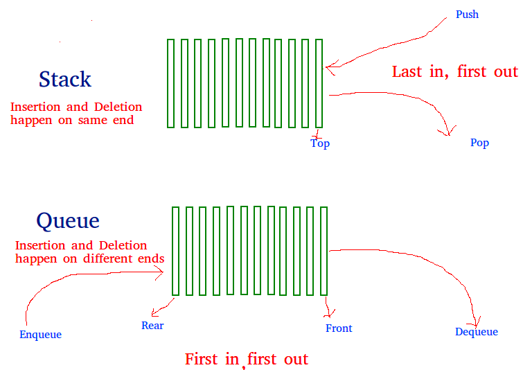

# Stacks Queues



## check balanced brackets

* if not stack
* and <-> or

```python
def isBalanced(s):
    brackets = [['{', '(', '['], ['}', ')', ']']]
    stack = []
    for c in s:
        if c in brackets[0]:
            stack.append(c)
        elif c in brackets[1]:
            if not stack or brackets[1][brackets[0].index(stack.pop())] != c:
                return 'NO'
    return 'YES' if not stack else 'NO'
```

## Queue

* popleft(), pop()

```python
from collections import deque


class MyQueue(object):

    def __init__(self):
        self._queue = deque()

    def peek(self):
        return self._queue[0]

    def pop(self):
        return self._queue.popleft()

    def put(self, value):
        self._queue.append(value)
```

## find largest (histogram)

* ⚠️ sorted or not
* find continuous ( break ! )

<details>
<summary>Naive approach</summary>

```python
def largestRectangle(h):
    stack = []
    largest_area = 0
    for idx, height in enumerate(h):
        width = 0
        for i in range(idx, -1, -1):
            if h[i] >= height:
                width += 1
            else:
                break
        for i in range(idx + 1, len(h)):
            if h[i] >= height:
                width += 1
            else:
                break
        largest_area = max(largest_area, width * height)
    return largest_area
```

</details>

```python
def largestRectangle(h):
    stack = []
    h.append(0)
    largest_area = 0
    i = 0
    while i < len(h):
        print(f"===================================\nfor {h[i]} bar: ")
        if not stack or h[i] > h[stack[-1]]:
            stack.append(i)
            i += 1
        else:
            height = h[stack.pop()]
            width = i if not stack else i - stack[-1] - 1  # k-j-1
            print(f'\t{largest_area} vs {height}*{width}')
            largest_area = max(largest_area, height * width)
        print(f"{list(map(lambda i: h[i], stack))}\t=> area: {largest_area} ")
    return largest_area

```

```python

def get_smaller_elems(li, arr, smaller_elems):
    stack = []
    for i in li:
        # print(f"\n{i}: {stack}")
        while stack and arr[stack[-1]] >= arr[i]:  # cur_elem <= last_elem
            stack.pop()  # remove bigger elem
        if stack:  # cur_elem is not the smallest (stack has only one index - the smaller elem)
            smaller_elems[i] = stack[-1]
            # print(f"fill) {i}: {smaller_elems}")
        stack.append(i)
    return smaller_elems


def riddle(arr):
    n = len(arr)

    # Find indexes of next smaller and previous smaller for every element
    left_smaller_elems = get_smaller_elems(range(n), arr, [-1] * (n + 1))
    right_smaller_elems = get_smaller_elems(range(n - 1, -1, -1), arr, [n] * (n + 1))
    print(f"left_smaller_elems:{left_smaller_elems}\tright_smaller_elems:{right_smaller_elems}")

    max_mins = [0] * (n + 1)

    # Fill answer array by comparing minimums
    # of all. Lengths computed using left[]
    # and right[]
    for i in range(n):
        # Length of the interval
        Len = right_smaller_elems[i] - left_smaller_elems[i] - 1
        # each elem is minimum in the window of size "Len"
        # print(f"{i}: ({right_smaller_elems[i]}) - ({left_smaller_elems[i]}) - 1 = {Len}")
        # print(i, arr[i], Len, max_mins[Len], )
        # arr[i] is a possible answer for this
        # Length 'Len' interval, check if arr[i]
        # is more than max for 'Len'
        max_mins[Len] = max(max_mins[Len], arr[i])  # regardless of window size, it will contain itself.
    print(max_mins)

    # Some entries in ans[] may not be filled yet. Fill them by taking values from right side of ans[]
    # If ans[i] is not filled => there is no direct element which is minimum of length i and therefore either the element of length ans[i+1], or ans[i+2], and so on is same as ans[i]
    for i in range(n - 1, 0, -1):
        max_mins[i] = max(max_mins[i], max_mins[i + 1])

    return max_mins[1:]
```
